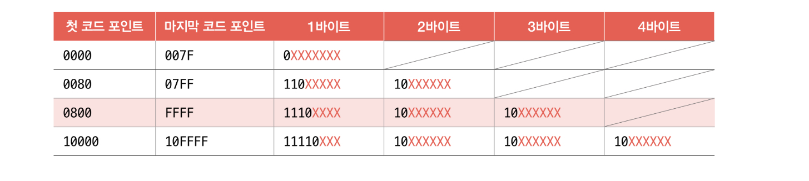

1. 3비트는 몇가지 정보를 표현할 수 있는가?

    8 가지 정보를 표현 

 

2. 0b110 + 0b10 의 결과를 10진수와 2진수로 표현하시오  

8 , 0b1000

 

3. 9를 2진수로 표현한 고 그것의 음수인 -9를 2진수로 표현하시오 

0x1001 , 0x0111

 

4. 컴퓨터가 양수인지 음수인지를 구분하기 위해 사용하는 것이 무엇인지 쓰시오

    플래그 

 

5.0xAC3을 2진수로 표현하라. 

0b1010 1100 0011  

 

6. 다음 중 틀린 것을 고르시오 
<pre>
1) 아스키 코드는 7비트로 표현하여 총 128개의 문자를 표현한다.
2) 아스키 코드는 내에 각 문자들은 인코딩 디코딩 되는 것들이  각각 존재한다. 
3) EUC-KR은 한글을 인코딩 하기 위한 방식이다. 
4) EUC -KR 완성형 인코딩 방식은 3바이트 크기의 코드를 부여한다. 
5) EUC-KR 방식으로 모든 글자를 표현할 수 없다.
</pre>

4번

 

7. UTF-8이 유니코드와 관련하여 무엇인지 서술하시오 

EUC-KR 방식을 넘어서 모든 언어를 아우르는 문자 집합과 통일된 
표준 인코딩 방식을 유니코드 문자 집합이 있다. 유니코드 문자 집합 내에서도 각 문자마다 고유한 값이 부여되는데, 그 값 자체를 바로 인코딩 값으로 삼지 않는다. 인코딩 하는 방식 중 UTF-8이 있다. 

 

다음 유니코드 표와 주어진 정보를 활용하여 답을 구하시오 

<pre>
유니코드 문자 집합에서 '하'에 부여된 값은 0xD558 '늘'에 부여된 값은 0xB298 입니다. UTF-8로 인코딩한 결과를 적으시오 
</pre>

    0xD558 = 0b 1101 0101 0101 1000
    0xB298 = 0b 1011 0010 1001 1000

    하 = 0b11101101 10010101 10011000 
    늘 = 0b11101011 10001010 10011000

