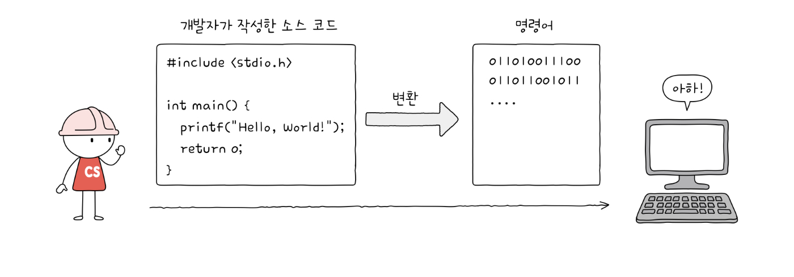
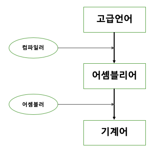
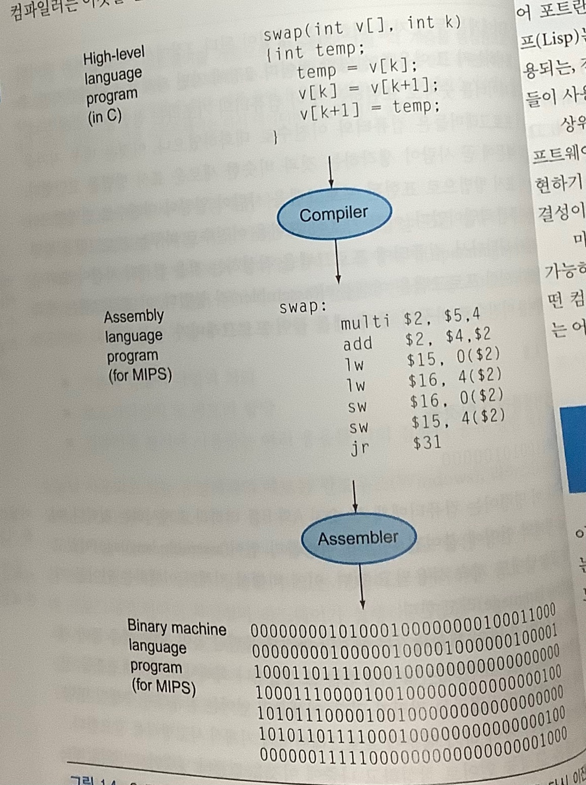
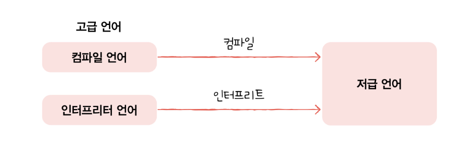
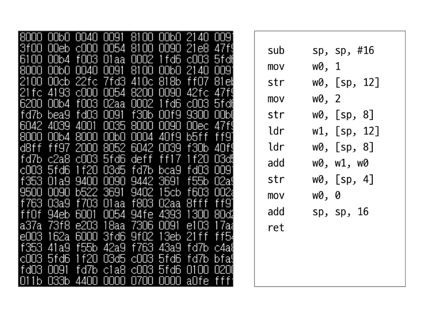

<br/>

<span style="color:green">본 내용은 혼자 공부하는 컴퓨터 구조와 운영체제 책 중 일부를 정리한 내용입니다.  
부분적으로 Computer Architecture and Design 5th 에 내용을 포함합니다.</span>  

   <pre>목차
   명령어 
      소스코드와 명령어  
         1.고급언어와 저급언어 
         2.어셈블리어 
         3.컴파일 언어와 인터프리터 언어 
      명령어 구조 
         1.연산코드와 오퍼랜드
         2.주소 지정 방식
   </pre>


<br/>

# 명령어 


## 소스코드와 명령어 
---- 


컴퓨터가 이해할 수 있는 것은 데이터와 <b>명령어</b>다.    
명령어에 대해 알아보려면 고급언어와 저급언어에 대해 알아야한다.  


### 1. 고급언어와 저급언어 
---


고급언어(소스코드)는 개발자가 ide 내에서 통상적으로 쓰는 언어를 의미한다. ex) c++ java ,python..  
고급언어를 곧바로 컴퓨터에게 이해시킬 순 없다. 0과 1로 바꿀 필요가 있다.  
저급언어는 어셈블리어와 기계어가 있다. 
0과 1로 구성된 언어를 기계어라고 하고 기계어를 인간친화적으로 만든 것아 어셈블리어다.  
저급언어를 통해 컴퓨터는 명령어를 해석하고 실행한다.


### 2. 어셈블리어   
---
최초의 개발자는 컴퓨터와 대화하기 위해 기계어를 직접 작성했다.   
기계어 작성에 지친 개발자는 어셈블러를 만들었다.

add A,B  

라고 쓰면 어셈블러가 이것을

1000110010100000

으로 바꾼다.  

어셈블리어 또한 개발자에게 여전히 기계식 사고를 버릴 수 없게 했다.   
  

고급언어는 인간의 자연스러운 언어처리 과정임을 알 수 있다.  
어셈블리어는 컴퓨터와 인간의 중간 과정임을 알 수 있다. 

### 3. 컴파일 언어와 인터프리터 언어 
---
  
고급언어가 저급언어로 변환되는 방식에 따라 컴파일 언어 혹은 인터프리터 언어라고 한다.
컴파일러는 소스 코드 전체를 훑어보고 실행가능한 코드인지 확인 후 변환한다. 
인터프리터는 소스 코드를 한 줄씩 차례 차례 변환한다.
컴파일러와 인터프리터가 변환한 코드를 목적코드라고 한다. 


## 명령어의 구조 
---
명령어는 컴퓨터 하드웨어가 일을 하기 위해 알아들을 수 있는 언어이다.  
앞서 배운 내용인 기계어와 어셈블리어는 한 줄 한 줄이 명령어이다.  
명령어는 크게 연산코드 오퍼랜드 주소 지정 방식이라는 개념으로 나뉜다.

### 1. 연산 코드와 오퍼랜드 
--- 
 

기계어와 어셈블리어의 공통점은 일관된 형태를 띄고 있다는 것이다.  
명령어는 연산코드(연산자) 와 연산에 사용할 데이터 (오퍼랜드)로 구성되어있다.

<pre> c언어 컴파일을 통한 명령어 구조 파악 

    c언어로 다음과 같은코드가 작성되어 있다.

    a = b + c;
    d = a - e;

    C 언어는 컴파일러를 통해 어셈블리어로 변환된다. 
    
    add a , b, c 
    sub d , a, e

    다음과 같은 규칙은 MIPS 명령어 집합 중 하나이다. 
    인간이 언어를 약속하듯 컴퓨터도 특정 명령어 집합을 통해 명령어를 약속한다. 
</pre>

오퍼랜드는 연산에 사용할 데이터가 저장된 위치를 의미한다.   
그래서 오퍼랜드 필드를 주소필드라고도 한다.  

[[!N주소명령어.jpeg]]

오퍼랜드는 명령어 안에서 0개에서 3개를 차지한다.  
연산코드는 명령어가 수행할 연산을 의미한다.  
연산코드는 데이터 전송 , 산술 논리 연산 , 제어 흐름 변경 , 입출력 제어가 대표적으로 있다. 

### 2. 주소 지정 방식 
---

오퍼랜드는 쉽게 말해 데이터 저장된 주소값을 명시하는 곳이다.   
컴퓨터가 한 번에 처리할 수 있는 데이터를 1 word라고 한다.  
이 1word의 길이에 따라 데이터를 저장할 수 있는 크기가 정해진다.  
명령어는 연산자와 오퍼랜드로 구성되기에 오퍼랜드에 데이터를 그대로 넣으면 데이터의 한계가 있다.  
오퍼랜드가 아닌  메모리 안에 데이터를 통으로 저장한다면 이를 극복할 수 있다. 
오퍼랜드 필드에 주소를 명시하는 것을 통해 이를 이용할 수 있고 , 이 주소를 유효 주소라고 한다.  

```
 a. 즉시 주소 지정 방식 
    오퍼랜드 필드에 데이터를 직접 명시하는 방식이다. 

    연산 코드 | 연산에 사용할 데이터

 b. 직접 주소 지정 방식 
    오퍼랜드 필드에 유효 주소를 명시하고 유효주소 내에 연산에 사용할 데이터를 저장한다.  

     연산 코드 | 유효 주소 (1번지)
                |
                |            메모리 
                |________>   |연산에 사용할 데이터| (1번지 )

 c. 간접 주소 방식 
    직접 주소 지정 방식은 유효 주소의 길이가 연산코드가 차지하는 크기만큼 줄어든다.
    이 한계를 극복하기 위해 오퍼랜드 필드에 유효 주소의 주소를 명시하는 방식이다. 

    연산 코드 | 유효 주소의 주소 
                |
                |                  메모리 
                |_____________>    | 유효  주소       | ---|
                                   |                |    |
                                   |연산에 사용할 데이터 | <__|
 
 d. 레지스터 주소 지정 방식 
    직접 주소 지정 방식과 유사한 형태이다. 오퍼랜드 필드에 레지스터를 명시한다.
    cpu내에서 제어장치를 통해 명령어를 다루기에 cpu 외부에 있는 메모리의 접근보다
    레지스터의 접근 시간이 빠르다. 

    연산 코드 | 유효 주소 (1번)
                |
                |            cpu 
                |________>   |연산에 사용할 데이터| (레지스터 1번 ) 

e. 레지스터 간접 주소 지정 방식 
   간접 주소 지정 방식과 유사한 형태이다. 오퍼랜드 필드에 레지스터 주소를 작성한다.
   레지스터 주소에는 유효주소가 작성되어 있고 유효 주소는 메모리 내에 데이터를 가리킨다.
   메모리에 두번 접근 하는 간접 주소 지정 방식과 달리 메모리에 한번 접근하는 이 방법이 
   더 빠르다. 

    연산 코드 | 레지스터 주소 (1번)
                |
                |            cpu 
                |________>   |유효 주소 | (레지스터 1번 ) ---|
                                                        |
                         메모리                           |
                         |연산에 사용할 데이터| <____________|

```